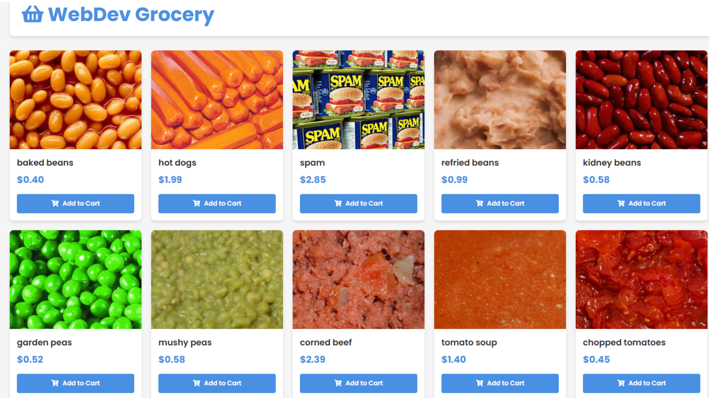
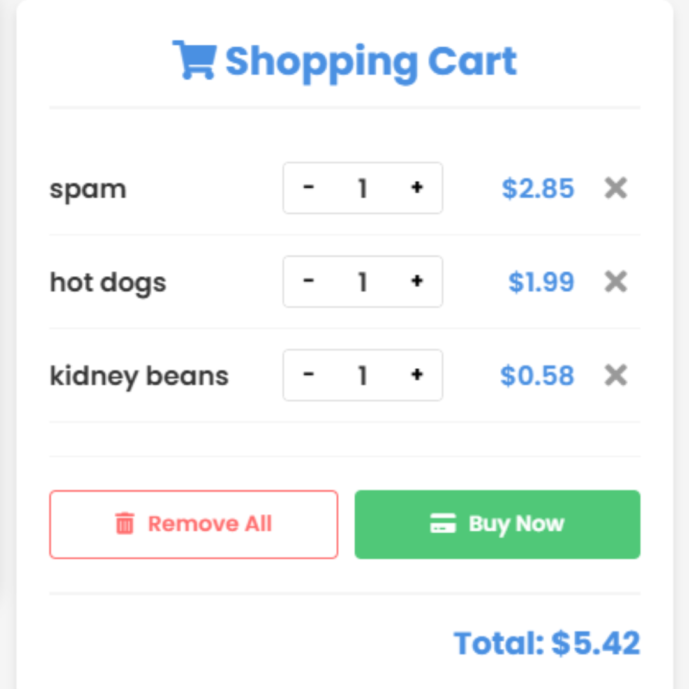

# GIPHY API Integration

## Overview
This project integrates the GIPHY API to fetch and display GIFs based on user input. The API allows access to trending GIFs, search functionality, and sticker collections.

## Getting Started
### 1. Obtain an API Key
1. Go to [GIPHY Developers](https://developers.giphy.com/)
2. Log in or sign up
3. Create a new API key under the 'Create an App' section

### 2. Make an API Request
#### Example in JavaScript (Fetch Trending GIFs)
```js
const apiKey = 'YOUR_API_KEY';
const url = `https://api.giphy.com/v1/gifs/trending?api_key=${apiKey}&limit=10`;

fetch(url)
  .then(response => response.json())
  .then(data => console.log(data))
  .catch(error => console.error('Error fetching data:', error));
```


## Features
- Search for GIFs by keyword
- Fetch trending GIFs
- Display GIFs in a web application
- Use stickers and animated emojis

## Deployment
This project is deployed using GitHub Pages. You can view the live version here:
[Live Demo]()

## 📷 Screenshots


*Example of the product list page.*


*Example of the shopping cart in action.*

